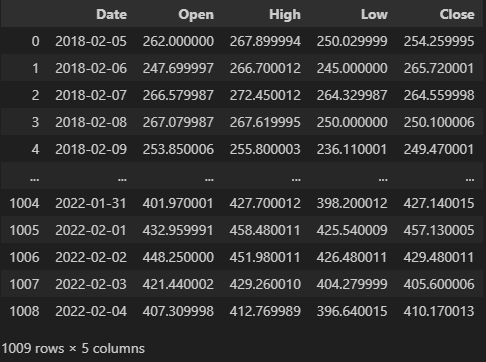

# 구현 기능 설명 
### F01
- **데이터 전처리**
  - **요구사항명** : CSV 파일 및 필드 선택
  - **요구사항 명세** : Netflix 주가 데이터(NFLX.csv)를 Pandas를 사용해 DataFrame으로 읽어온다.
  이 때, 'Date', 'Open', 'High', 'Low', 'Close' 필드만 선택한다.

## 기능 개요
- NFLX.csv에서 ‘Date’, ‘Open’, ‘High’, ‘Low’, ‘Close’ 컬럼만 골라 읽어오는 기능입니다.

-------------------------------------------------------------------------------

### F02
- **데이터 전처리**
  - **요구사항명** : 날짜 필터링
  - **요구사항 명세** : 2021년 이후 데이터 필터링

1. NFLX.csv에서 ‘Date’, ‘Open’, ‘High’, ‘Low’, ‘Close’ 다섯 개 컬럼만 읽어와 DataFrame을 만들고,

2. Date 컬럼을 datetime 타입으로 변환한 뒤 2021-01-01 이후 데이터만 필터링해 df_filter에 저장합니다.

3. plt.plot()으로 필터링된 날짜별 Close 값을 선 그래프로 그리고,

4. 제목·축 레이블을 붙이고 x축 눈금 글자를 45° 회전해 가독성을 높인 뒤 출력합니다.

-------------------------------------------------------------------------------

### F03
- **데이터 분석**
  - **요구사항명** : 최고/최저 종가 추출
  - **요구사항 명세** : 2021년 이후 데이터에서 종가(Close)의 최대/최소 값을 추출

1. np.loadtxt 함수로 CSV 파일을 NumPy 배열로 읽어오는 file_open_by_numpy()를 정의했지만, 실제로는 Pandas read_csv로 ‘Date’, ‘Open’, ‘High’, ‘Low’, ‘Close’ 다섯 컬럼만 읽습니다.

2. 읽어온 df에서 Date를 datetime 타입으로 바꾸고, 2021-01-01 이후 데이터만 df_filter에 남깁니다.

3. plt.plot()으로 필터링된 날짜별 종가(Close)를 선 그래프로 그리고,

4. 제목·축 레이블을 붙이고 x축 레이블을 45° 회전해 가독성을 높인 뒤 화면에 출력합니다.

-------------------------------------------------------------------------------

### F04
- **데이터 분석**
  - **요구사항명** : 월별 평균 종가 계산
  - **요구사항 명세** : 2021년 이후 데이터를 월별로 그룹화하여 
  평균 종가를 계산하여 시각화

1. NFLX.csv에서 ‘Date’, ‘Open’, ‘High’, ‘Low’, ‘Close’ 컬럼만 읽어서 df로 만듭니다.

2. Date를 날짜 타입으로 변환하고, 2021-01-01 이후 데이터만 남긴 뒤 YearMonth(“YYYY-MM”) 문자열 컬럼을 추가합니다.

3. groupby('YearMonth')로 월별 평균 종가를 계산하고, 다시 날짜 타입으로 바꿔 monthly에 저장합니다.

4. plt.plot()으로 월별 평균 종가를 꺾은선 그래프로 그리며, 제목·축 레이블을 붙이고 x축 글자를 45° 회전해 깔끔하게 출력합니다.

-------------------------------------------------------------------------------

### F05
- **데이터 시각화**
  - **요구사항명** : 일별 최고/최저/종가 시각화
  - **요구사항 명세** : 2022년 이후 데이터를 바탕으로 3가지
지표를 하나의 그래프에 시각화

1. NFLX.csv에서 날짜·시가·고가·저가·종가 컬럼만 읽고, Date를 날짜 타입으로 파싱합니다.

2. 2022-01-01 이후 데이터만 남기고 인덱스를 초기화한 뒤, Date별로

    - High는 그날의 최대값,

    - Low는 그날의 최소값,

    - Close는 그날 마지막 종가로 묶어서 daily라는 새 데이터프레임을 만듭니다.

3. daily['Date']를 다시 datetime으로 바꾼 다음, Matplotlib으로

    - 날짜별 High, Low, Close를 각기 다른 선으로 그리되

    - 5일 간격으로 x축 눈금을 찍고 “YYYY-MM-DD” 형식으로 표시합니다.

4. 제목·축 라벨·범례·그리드를 추가해 깔끔한 일별 주가 그래프를 완성합니다.

# 학습 내용

**1. 데이터 로딩 & 선택**

    - np.loadtxt와 pd.read_csv를 통해 CSV 파일을 읽어오는 방법

    - usecols로 필요한 컬럼만 골라 메모리와 가독성 최적화

**2. 타입 변환 & 필터링**

    - parse_dates 혹은 pd.to_datetime으로 날짜 문자열을 datetime 객체로 변환

    - 불린 인덱싱(df[df['Date'] >= '2021-01-01'])으로 특정 기간 데이터만 추출

**3. 집계(Aggregation) & 그룹화(Grouping)**

    - .groupby(df['Date'].dt.date) + .mean() 으로 일별 평균 종가 계산

    - .groupby(df['YearMonth']) 또는 .resample('M') 으로 월별 평균/최대/최소/종가 집계

    - reset_index()·as_index=False로 결과를 다시 DataFrame 형태로 정리

**4. 시각화(Visualization)**

    - matplotlib.pyplot의 plot()으로 시계열(line) 그래프 그리기

    - figsize, marker, linewidth, linestyle 옵션으로 스타일 조정

    - xticks(rotation=…), MonthLocator·DayLocator, DateFormatter로 축 레이블 가독성 확보

    - title, xlabel, ylabel, legend, grid 등으로 완성도 높은 차트 꾸미기

이 네 단계를 통해 “CSV → 시계열 분석 → 시각화” 전 과정을 손쉽게 구현할 수 있으며, 필요에 따라 일별·월별 집계와 다양한 차트 스타일을 적용하는 방법을 익혔습니다.

# 느낀 점 

대학 시절 머신러닝의 기초를 공부하면서 판다스와 넘파이의 기본 개념을 익히긴 했지만, 실제 프로젝트나 과제를 제외하고는 한 줄의 코드를 통째로 스스로 설계하고 구현해 본 적은 없었습니다. 그런데 이번에 CSV 데이터를 불러와 전처리하고, 원하는 기간만 필터링한 뒤, 일별·월별로 집계하고 시각화까지 한 편의 완전한 파이프라인을 직접 작성하면서 비로소 ‘내 손으로 데이터 분석의 흐름 전체를 만들어냈다’는 성취감을 느꼈습니다.

물론 초보자로서 부족한 부분이 여럿 드러났지만, 그 하나하나를 경험 삼아 오류를 해석하고 해결책을 찾아가는 과정 자체가 값진 학습이었습니다. 앞으로는 이 작은 성공을 발판 삼아, 의존하지 않고 스스로 새로운 도전 과제를 설계하고 완수하는 연습을 꾸준히 이어갈 것입니다. 이렇게 능동적으로 학습하다 보면 어느 순간 “어떤 도움도 없이도 복잡한 분석 코드를 설계하고 구현할 수 있겠다”는 자신감이 자연스레 쌓일 것이라 믿습니다.

